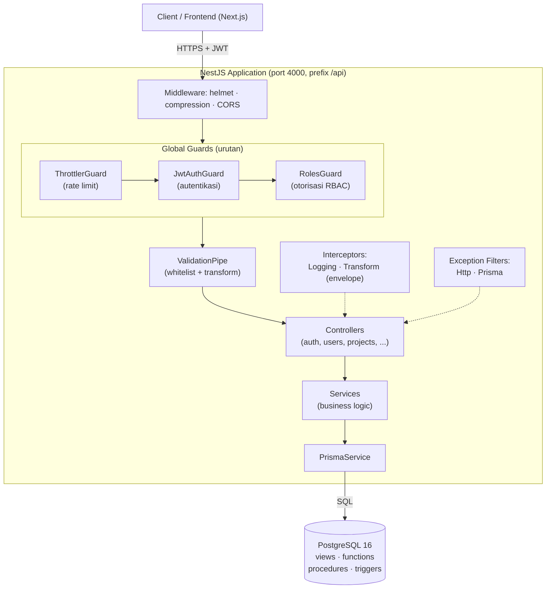
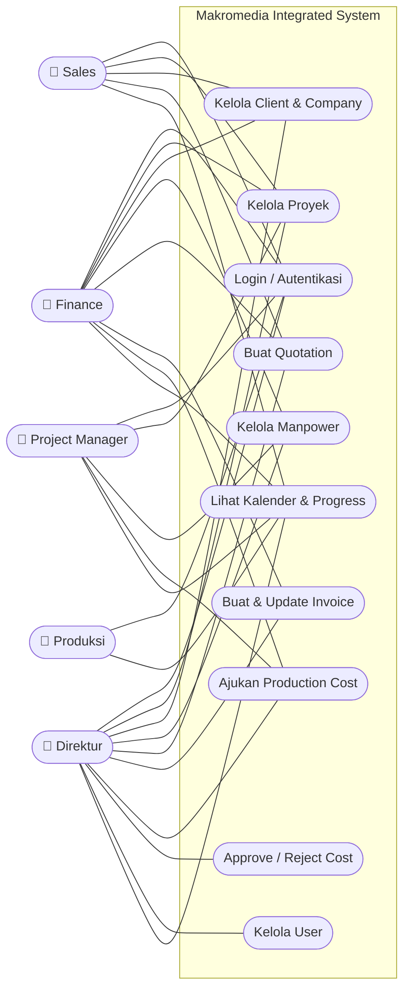
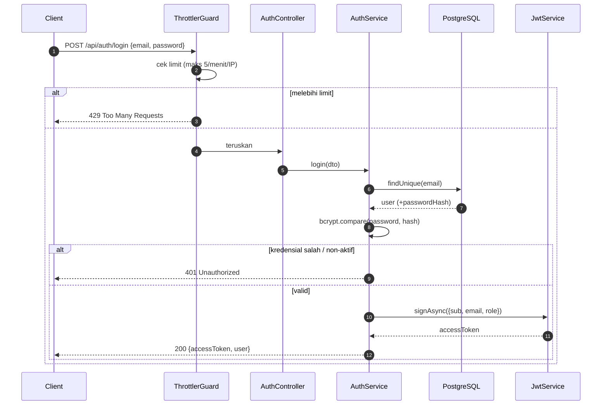
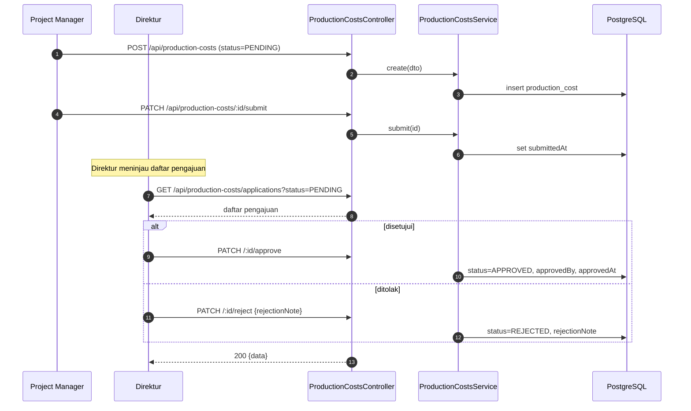
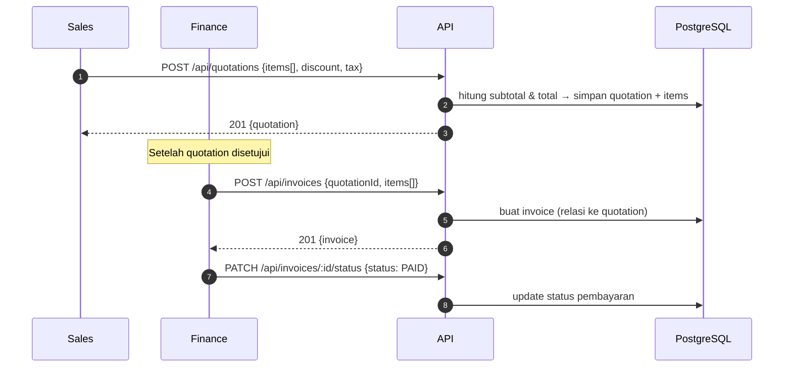
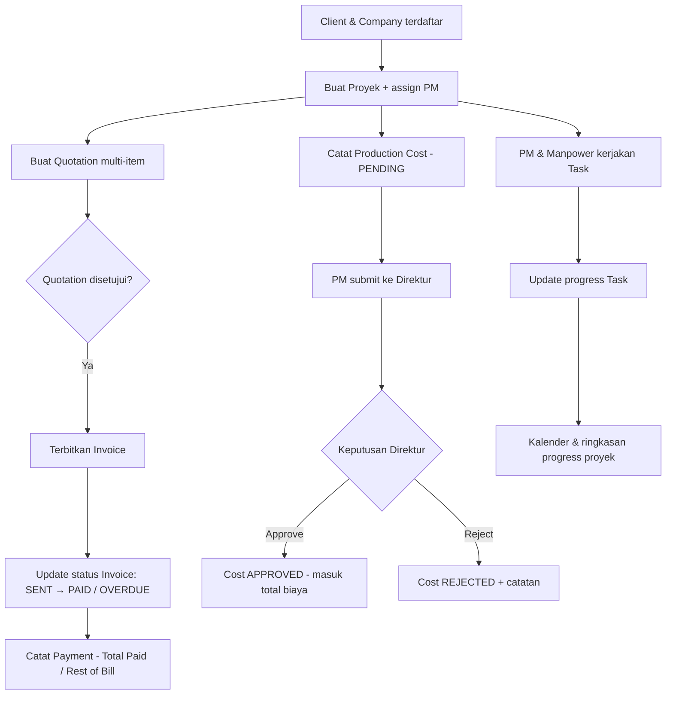
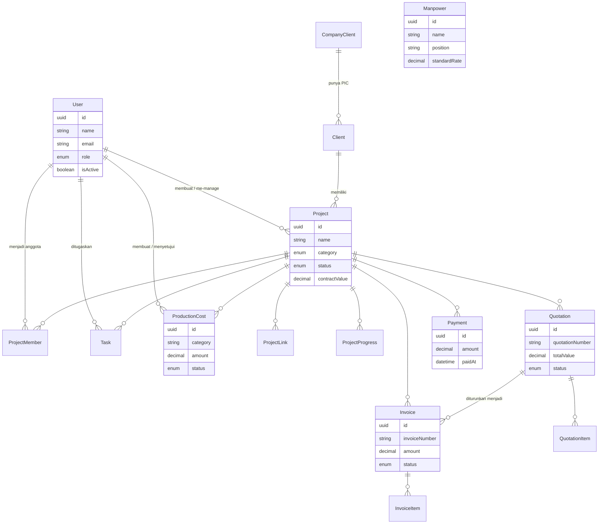

# Makromedia Integrated System - Backend

REST API untuk **Sistem Manajemen Proyek Terintegrasi** milik **CV. Makromedia Visual** - agensi
kreatif yang menangani *event*, *corporate video*, *film production*, dan *wedding*. Sistem ini
menyatukan alur kerja end-to-end mulai dari akuisisi proyek, penawaran (quotation), penagihan
(invoice), pencatatan biaya produksi dengan *approval workflow*, manajemen manpower, hingga pemantauan
progress - seluruhnya diproteksi dengan autentikasi JWT dan **Role-Based Access Control (RBAC)**.

Backend dibangun mengikuti *Software Design Document* (SDD) dengan pendekatan **database-first**,
arsitektur **modular** ala NestJS, dan objek database native PostgreSQL (view, function, procedure,
trigger, constraint).

> Frontend (Next.js) berada di repositori terpisah:
> [Frontend_Makromedia-Integrated-System](https://github.com/bisaqris/Frontend_Makromedia-Integrated-System).

---

## Daftar Isi

1. [Fitur Utama](#fitur-utama)
2. [Tech Stack](#tech-stack)
3. [Arsitektur & Metode](#arsitektur--metode)
4. [Use Case Diagram](#use-case-diagram)
5. [Sequence Diagram](#sequence-diagram)
6. [Alur Sistem](#alur-sistem)
7. [Model Data (ERD)](#model-data-erd)
8. [RBAC (Matriks Hak Akses)](#rbac-matriks-hak-akses)
9. [Referensi API / Endpoint](#referensi-api--endpoint)
10. [Format Response & Error](#format-response--error)
11. [Objek Database](#objek-database)
12. [Keamanan (Security Hardening)](#keamanan-security-hardening)
13. [Struktur Folder](#struktur-folder)
14. [Prasyarat & Instalasi](#prasyarat--instalasi)
15. [Environment Variables](#environment-variables)
16. [Script NPM](#script-npm)
17. [Alur Git (Git Flow)](#alur-git-git-flow)
18. [Akun Demo](#akun-demo)

---

## Fitur Utama

| Domain | Ringkasan |
| ------ | --------- |
| **Autentikasi** | Login email + password, JWT Bearer, endpoint `me`, guard global + rate limiting anti brute-force. |
| **User Management** | CRUD user & assignment role (khusus Direktur). |
| **Client Data** | Data perusahaan klien (Company Client) & PIC (Client), soft-delete. |
| **Manpower** | Data tenaga kerja/kru produksi beserta skill, rate, dan info bank. |
| **Project** | CRUD proyek, kategori, kontrak, timeline, PM assignment, scoping data per role. |
| **Quotation** | Penawaran multi-item dengan diskon & pajak, auto-kalkulasi subtotal & total. |
| **Invoice** | Penagihan multi-item, dapat diturunkan dari quotation, update status pembayaran. |
| **Production Cost** | Pencatatan biaya + **approval workflow** (submit → approve/reject oleh Direktur). |
| **Calendar** | Agregasi event proyek (turunan, tidak dipersistensi). |
| **Health Check** | Status aplikasi, latensi database, dan penggunaan memori. |

---

## Tech Stack

| Lapisan | Teknologi | Versi |
| ------- | --------- | ----- |
| **Runtime** | Node.js | ≥ 20 |
| **Framework** | [NestJS](https://nestjs.com/) (modular, DI, decorator) | 11.1.x |
| **Bahasa** | TypeScript | 5.9.x |
| **ORM** | [Prisma](https://www.prisma.io/) | 6.19.x |
| **Database** | PostgreSQL | 16 |
| **Autentikasi** | JWT (`@nestjs/jwt`) · Passport (`passport-jwt`) | 11.x / 4.x |
| **Password Hashing** | bcryptjs (cost factor 12) | 3.x |
| **Validasi** | class-validator · class-transformer | 0.15.x / 0.5.x |
| **Keamanan** | helmet · `@nestjs/throttler` (rate limit) · CORS whitelist | 8.x / 6.x |
| **Performa** | compression (gzip) | 1.8.x |
| **Dokumentasi API** | Swagger / OpenAPI (`@nestjs/swagger`) | 11.x |
| **Reactive** | RxJS | 7.8.x |
| **Package Manager** | pnpm | 11.x |

---

## Arsitektur & Metode

**Metodologi & prinsip yang diterapkan:**

- **Database-first** - `schema.prisma` adalah *single source of truth*; objek SQL kustom
  (view/function/procedure/trigger) diterapkan via script.
- **Modular architecture** - tiap domain adalah *feature module* (controller → service → Prisma),
  dependency injection, dan pemisahan tanggung jawab (SoC).
- **Cross-cutting concerns** ditangani terpusat via **Guard**, **Interceptor**, dan **Filter** global.
- **Defense in depth** - validasi input, RBAC, rate limiting, security headers, dan fail-fast env
  validation berlapis.



**Siklus request:** `Middleware → ThrottlerGuard → JwtAuthGuard → RolesGuard → ValidationPipe →
Controller → Service → PrismaService → PostgreSQL`, dengan **LoggingInterceptor** (latensi),
**TransformInterceptor** (envelope response), dan **Exception Filters** (normalisasi error) sebagai
lapisan lintas-fungsi.

---

## Use Case Diagram



---

## Sequence Diagram

### 1) Autentikasi (Login)



### 2) Approval Production Cost



### 3) Quotation → Invoice



---

## Alur Sistem



---

## Model Data (ERD)

Entitas inti mengikuti *class diagram* SDD (13 class inti + 3 tabel operasional). Konvensi: kolom &
tabel database memakai `snake_case` via `@map`/`@@map`.



**Enumerasi domain:**

| Enum | Nilai |
| ---- | ----- |
| `RoleUser` | `SALES`, `PRODUKSI`, `PROJECT_MANAGER`, `FINANCE`, `DIREKTUR` |
| `StatusProyek` | `DRAFT`, `ACTIVE`, `ON_HOLD`, `COMPLETED`, `CANCELLED` |
| `StatusTask` | `TODO`, `IN_PROGRESS`, `DONE` |
| `StatusQuotation` | `DRAFT`, `SENT`, `APPROVED`, `REJECTED` |
| `StatusInvoice` | `DRAFT`, `SENT`, `PAID`, `OVERDUE` |
| `StatusBiaya` | `PENDING`, `APPROVED`, `REJECTED` |
| `KategoriProyek` | `EVENT`, `CORPORATE_VIDEO`, `FILM_PRODUCTION`, `WEDDING`, `OTHER` |

> Tabel operasional tambahan di luar 13 class inti: `project_members` (relasi M-N user-proyek),
> `project_links` (tautan deliverable), dan `payments` (riwayat pembayaran untuk *Total Paid* /
> *Rest of Bill*). `CalendarEvent` bersifat turunan (dibangun on-the-fly, tidak dipersistensi).

---

## RBAC (Matriks Hak Akses)

Guard global `JwtAuthGuard → RolesGuard` memproteksi seluruh endpoint kecuali yang ditandai
`@Public()`. Tanpa `@Roles`, endpoint dapat diakses **semua role terautentikasi**.

| Modul / Aksi | Sales | Finance | PM | Produksi | Direktur |
| ------------ | :---: | :-----: | :-: | :------: | :------: |
| Lihat proyek (scoped) | ✅ | ✅ | ✅¹ | ✅¹ | ✅ |
| Tambah proyek | ✅ | ✅ | - | - | ✅ |
| Edit proyek | ✅ | ✅ | ✅ | - | ✅ |
| Hapus proyek | - | ✅ | - | - | ✅ |
| Client & Company (tambah/edit) | ✅ | ✅ | - | - | ✅ |
| Client & Company (hapus) | - | ✅ | - | - | ✅ |
| Manpower (tambah/edit) | - | ✅ | ✅ | - | ✅ |
| Manpower (hapus) | - | ✅ | - | - | ✅ |
| Quotation (buat) | ✅ | ✅ | - | - | ✅ |
| Invoice (buat/status) | - | ✅ | - | - | ✅ |
| Production Cost (buat/edit) | - | ✅ | ✅ | - | ✅ |
| Production Cost - submit | - | - | ✅ | - | - |
| Production Cost - approve/reject | - | - | - | - | ✅ |
| User Management | - | - | - | - | ✅ |

<sub>¹ PM & Produksi hanya melihat proyek yang menjadi tanggung jawabnya (data di-*scope* di service).</sub>

---

## Referensi API / Endpoint

**Base URL:** `http://localhost:4000/api` · **Auth:** `Authorization: Bearer <accessToken>`
(kecuali endpoint ber-tag *Public*) · **Swagger UI:** `http://localhost:4000/api/docs` (non-production).

### Auth - `/auth`
| Method | Path | Akses | Body / Query | Deskripsi |
| ------ | ---- | ----- | ------------ | --------- |
| `POST` | `/auth/login` | Public · *rate limit 5/menit* | `{ email, password }` | Login, mengembalikan `accessToken` + `user`. |
| `GET` | `/auth/me` | Authenticated | - | Profil user dari token. |

### Health - `/health`
| Method | Path | Akses | Deskripsi |
| ------ | ---- | ----- | --------- |
| `GET` | `/health` | Public | Status app, latensi DB, memori. |

### Users - `/users` *(seluruh modul: Direktur)*
| Method | Path | Body | Deskripsi |
| ------ | ---- | ---- | --------- |
| `GET` | `/users` | - | Daftar user (tanpa `passwordHash`). |
| `POST` | `/users` | `{ name, email, password(min 8), role }` | Buat user baru. |

### Company Clients - `/company-clients`
| Method | Path | Akses | Body |
| ------ | ---- | ----- | ---- |
| `GET` | `/company-clients` | Authenticated | - |
| `POST` | `/company-clients` | Sales, Finance, Direktur | `{ name, email?, phone?, website?, address? }` |
| `PATCH` | `/company-clients/:id` | Sales, Finance, Direktur | *(sama)* |
| `DELETE` | `/company-clients/:id` | Finance, Direktur | - |

### Clients (PIC) - `/clients`
| Method | Path | Akses | Body |
| ------ | ---- | ----- | ---- |
| `GET` | `/clients` | Authenticated | - |
| `POST` | `/clients` | Sales, Finance, Direktur | `{ companyClientId, name, email?, phone?, address? }` |
| `PATCH` | `/clients/:id` | Sales, Finance, Direktur | *(sama)* |
| `DELETE` | `/clients/:id` | Finance, Direktur | - |

### Manpower - `/manpower`
| Method | Path | Akses | Body |
| ------ | ---- | ----- | ---- |
| `GET` | `/manpower` | Authenticated | - |
| `POST` | `/manpower` | PM, Finance, Direktur | `{ name, position?, email?, phone?, skill?, employmentStatus?, bankName?, bankAccountNo?, standardRate? }` |
| `PATCH` | `/manpower/:id` | PM, Finance, Direktur | *(sama)* |
| `DELETE` | `/manpower/:id` | Finance, Direktur | - |

### Projects - `/projects`
| Method | Path | Akses | Body / Query |
| ------ | ---- | ----- | ------------ |
| `GET` | `/projects` | Authenticated *(scoped)* | Query: `search?`, `category?`, `status?` |
| `GET` | `/projects/:id` | Authenticated *(scoped)* | - |
| `POST` | `/projects` | Sales, Finance, Direktur | `{ name, category, clientId, projectManagerId?, contractValue?, eventDate?, startDate?, endDate?, ... }` |
| `PATCH` | `/projects/:id` | Sales, Finance, Direktur, PM | *(partial)* |
| `DELETE` | `/projects/:id` | Finance, Direktur | - |

### Quotations - `/quotations`
| Method | Path | Akses | Body |
| ------ | ---- | ----- | ---- |
| `GET` | `/quotations/project/:projectId` | Authenticated | - |
| `GET` | `/quotations/:id` | Authenticated | - |
| `POST` | `/quotations` | Sales, Finance, Direktur | `{ projectId, quotationNumber, discountPercent?, taxAmount?, notes?, items: [{ item, unitPrice, quantity, frequency?, period? }] }` |

### Invoices - `/invoices`
| Method | Path | Akses | Body |
| ------ | ---- | ----- | ---- |
| `GET` | `/invoices/project/:projectId` | Authenticated | - |
| `POST` | `/invoices` | Finance, Direktur | `{ projectId, quotationId?, invoiceNumber, dueDate?, paymentInstruction?, items: [...] }` |
| `PATCH` | `/invoices/:id/status` | Finance, Direktur | `{ status: DRAFT\|SENT\|PAID\|OVERDUE }` |

### Production Costs - `/production-costs`
| Method | Path | Akses | Body / Query |
| ------ | ---- | ----- | ------------ |
| `GET` | `/production-costs/applications` | Direktur | Query: `status?` |
| `GET` | `/production-costs/project/:projectId` | Authenticated | - |
| `POST` | `/production-costs` | PM, Finance, Direktur | `{ projectId, category, unitPrice, quantity?, frequency?, executorName?, ... }` |
| `PATCH` | `/production-costs/:id` | PM, Finance, Direktur | *(partial)* |
| `PATCH` | `/production-costs/:id/submit` | PM | - |
| `PATCH` | `/production-costs/:id/approve` | Direktur | - |
| `PATCH` | `/production-costs/:id/reject` | Direktur | `{ rejectionNote }` |
| `DELETE` | `/production-costs/:id` | PM, Finance, Direktur | - |

### Calendar - `/calendar`
| Method | Path | Akses | Deskripsi |
| ------ | ---- | ----- | --------- |
| `GET` | `/calendar/events` | Authenticated | Event proyek (turunan, di-*scope* per user). |

---

## Format Response & Error

**Response sukses** dibungkus envelope seragam oleh `TransformInterceptor`:

```json
{
  "statusCode": 200,
  "message": "Success",
  "data": { }
}
```

**Response error** dinormalisasi oleh `HttpExceptionFilter` / `PrismaExceptionFilter`:

```json
{
  "statusCode": 409,
  "errorCode": "P2002",
  "message": "Data dengan nilai unik tersebut sudah terdaftar di database [email].",
  "timestamp": "2026-08-13T09:00:00.000Z",
  "path": "/api/users"
}
```

| Kode | Makna |
| ---- | ----- |
| `400` | Validasi gagal / Foreign Key violation (`P2003`). |
| `401` | Token tidak valid / kredensial salah. |
| `403` | Role tidak berwenang (RBAC). |
| `404` | Data tidak ditemukan (`P2025`). |
| `409` | Duplikasi nilai unik (`P2002`). |
| `429` | Melebihi rate limit. |
| `500` | Kesalahan internal (stack trace hanya di-log server-side). |

---

## Objek Database

Diterapkan via `pnpm db:objects` (`prisma/apply-sql-objects.ts`) setelah skema dibuat:

- **Views** - `vw_project_detail`, `vw_task_monitoring`, `vw_production_cost_summary`.
- **Functions** - `fn_total_production_cost(project_id)` (total biaya `APPROVED`),
  `fn_project_progress(project_id)` (rata-rata progress task).
- **Procedures** - `sp_add_project_member(project_id, user_id)`,
  `sp_create_invoice(project_id, quotation_id, created_by, invoice_number, amount, due_date)`.
- **Triggers** - auto `updated_at`, auto `sub_total` (item quotation/invoice), auto `amount`
  (production cost = `unit_price × quantity × frequency`).
- **Constraints** - `CHECK` progress task 0-100.

---

## Keamanan (Security Hardening)

- **Fail-fast env validation** (`validateEnv`) - aplikasi menolak start bila `DATABASE_URL`/
  `JWT_SECRET` kosong, terlalu pendek (< 16 karakter), atau masih placeholder (fatal di production).
- **JWT** - Bearer token, tanpa *secret* default yang tidak aman.
- **RBAC berlapis** - `JwtAuthGuard` → `RolesGuard` global.
- **Rate limiting** (`@nestjs/throttler`) - global **100 request/60 detik**, login **5/60 detik** per IP.
- **helmet** - security headers (CSP aktif di production).
- **CORS whitelist** - hanya origin dari `FRONTEND_URL` (tanpa fallback wildcard).
- **Password** - bcrypt cost factor **12**; `passwordHash` tak pernah dikembalikan ke klien.
- **ValidationPipe global** - `whitelist` + `forbidNonWhitelisted` + `transform`.
- **Swagger** dimatikan di production; **compression** & **graceful shutdown hooks** aktif.
- **Dependency** - 0 kerentanan (`pnpm audit`), override keamanan di `pnpm-workspace.yaml`.

---

## Struktur Folder

```
Backend_Makromedia-Integrated-System/
├── prisma/
│   ├── schema.prisma          # sumber kebenaran struktur database
│   ├── sql/                    # 01_views · 02_functions · 03_triggers_constraints
│   ├── seed.ts                 # data awal
│   └── apply-sql-objects.ts    # menerapkan objek SQL kustom
├── src/
│   ├── common/                 # decorators · guards · filters · interceptors
│   ├── config/                 # configuration · env.validation
│   ├── health/                 # health check
│   ├── prisma/                 # PrismaService (global)
│   ├── modules/                # auth · users · projects · clients · company-clients
│   │                           # manpower · quotations · invoices · production-costs · calendar
│   ├── app.module.ts
│   └── main.ts                 # bootstrap (helmet, cors, swagger, throttler)
├── docker-compose.yml          # PostgreSQL 16
├── nest-cli.json · tsconfig.json
├── package.json · pnpm-workspace.yaml
└── README.md
```

---

## Prasyarat & Instalasi

**Prasyarat:** Node.js ≥ 20 · pnpm ≥ 9 · Docker (untuk PostgreSQL) atau PostgreSQL 16 lokal.

```bash
# 1. Nyalakan database (PostgreSQL → localhost:5433)
docker compose up -d postgres

# 2. Siapkan environment & dependency
cp .env.example .env          # isi DATABASE_URL & JWT_SECRET (acak, ≥ 16 char)
pnpm install

# 3. Generate client, skema, objek SQL, dan seed
pnpm prisma:generate
pnpm db:migrate --name init   # atau: pnpm db:setup (push + objek SQL + seed)
pnpm db:objects
pnpm db:seed

# 4. Jalankan
pnpm start:dev
# API  → http://localhost:4000/api
# Docs → http://localhost:4000/api/docs
```

> Buat `JWT_SECRET` kuat:
> `node -e "console.log(require('crypto').randomBytes(48).toString('base64url'))"`

---

## Environment Variables

| Variabel | Wajib | Default | Keterangan |
| -------- | :---: | ------- | ---------- |
| `DATABASE_URL` | ✅ | - | Koneksi PostgreSQL (Prisma). |
| `JWT_SECRET` | ✅ | - | Min. 16 karakter, bukan placeholder. |
| `JWT_EXPIRES_IN` | - | `1d` | Masa berlaku token. |
| `PORT` | - | `4000` | Port HTTP. |
| `NODE_ENV` | - | `development` | `production` mengaktifkan mode ketat. |
| `FRONTEND_URL` | - | `http://localhost:3000` | Whitelist CORS (comma-separated). |

---

## Script NPM

| Script | Fungsi |
| ------ | ------ |
| `pnpm start:dev` | Jalankan dengan watch mode. |
| `pnpm build` / `pnpm start:prod` | Build ke `dist/` / jalankan production. |
| `pnpm prisma:generate` | Generate Prisma Client. |
| `pnpm db:migrate` | Migrasi development. |
| `pnpm db:setup` | `db push` + objek SQL + seed (sekali jalan). |
| `pnpm db:seed` / `pnpm db:objects` | Seed data / terapkan objek SQL. |
| `pnpm lint` | ESLint + fix. |

---

## Alur Git (Git Flow)

```
feature/* · bugfix/* · chore/* · refactor/* · perf/* · docs/*
        │  (Pull Request)
        ▼
     develop  ──►  staging  ──►  main (release)
```

Branch dibuat dari `develop` dengan prefix sesuai jenis perubahan, di-*merge* via Pull Request.
Commit mengikuti **Conventional Commits** (`feat(scope): ...`, `fix: ...`, `chore(deps): ...`).

---

## Akun Demo

Semua akun memakai password **`Password123!`**.

| Role | Email |
| ---- | ----- |
| Direktur | `direktur@makromedia.id` |
| Finance | `finance@makromedia.id` |
| Sales | `sales@makromedia.id` |
| Project Manager | `pm@makromedia.id` |
| Produksi | `produksi@makromedia.id` |
